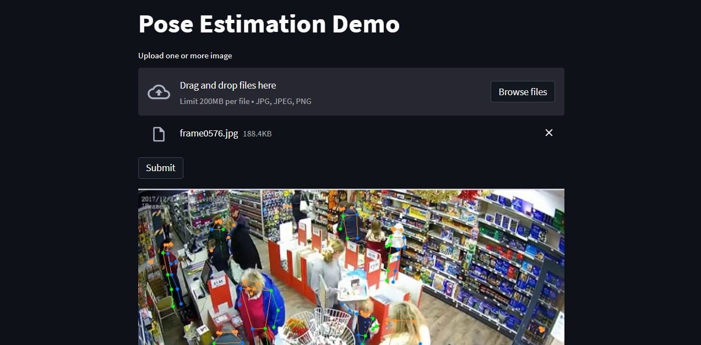

# Real-Time Multi-Person Pose Estimation Demo
______________________________________________________________________
## [Model Introduction: RTMPose](https://arxiv.org/abs/2303.07399)

RTMPose is a high-performance real-time multi-person pose estimation framework, which achieves excellence in balancing model performance and complexity and can be deployed on various devices (CPU, GPU, and mobile devices) or real-time inference.

RTMPose-m achieves 75.8% AP on COCO with 90+ FPS on an Intel i7-11700 CPU and 430+ FPS on an NVIDIA GTX 1660 Ti GPU, and RTMPose-l achieves 67.0% AP on COCO-WholeBody with 130+ FPS. RTMPoses achieves 72.2% AP on COCO with 70+ FPS on a Snapdragon 865 chip, outperforming existing open-source libraries.

With the help of MMDeploy, RTMPose supports various platforms like CPU, GPU, NVIDIA Jetson, and mobile devices and multiple inference backends such as ONNXRuntime, TensorRT, ncnn, etc.


______________________________________________________________________


## Table of contents
  - [System design](#system-design)
  - [Reproducing the Source code](#Reproducing-the-Source-code)
    - [Environment Setup](#environment-setup)
    - [Config model](#config-model)
    - [Run demo](#run-demo)
    - [Inference with CLI](#inference-cli)


## System design
This system uses Streamlit for the Frontend and FastAPI for the backend to process multile image files.

1. Frontend: The frontend is built using  Streamlit, allows users to upload multiple image files for processing. Once the images have been processed by the backend, the results are displayed in the Streamlit app.

2. Backend: The backend is built using FastAPI and processes the uploaded images file. Respone json output predicted and image visualize results. The results are then sent back to the frontend for display.

## Reproducing the Source code:
To repoduce the source code, follow these steps:

## 1. Environment Setup: <a name="environment-setup"></a>
Build Docker Image with Dockerfile:
```
docker build -t pose_estimation .
```
Run Docker container:
```
docker run -it -v "$PWD":/workspace --network host --ipc=host --name pose_estimation_demo pose_estimation bash
```

## 2. Config model: <a name="config-model"></a>
You can change model config in configs/config.yaml file. 

RTMPose provides a wide variety of pre-trained models for pose estimation, which can be found in the [Model Zoo](https://github.com/open-mmlab/mmpose/tree/98ccc8a8aefd7541154580770f033a299541d2f5/projects/rtmpose).


## 3. Run demo: <a name="run-demo"></a>
To demo the service, run this script:

```
bash script/run_demo.sh
```




## 4. Inference with CLI: <a name="inference-cli"></a>
```
python inference.py --config configs/config.yaml --input {video/image file} --output-root {save folder}
```
